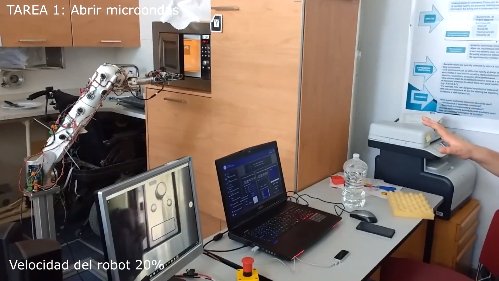
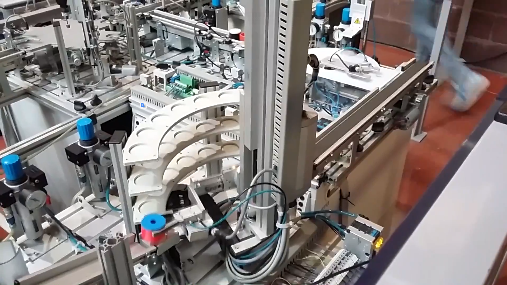
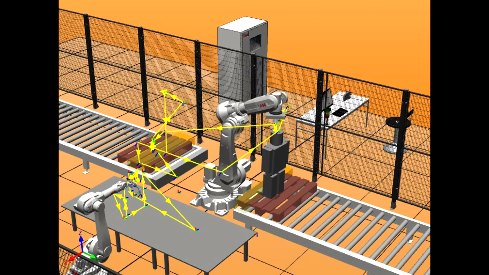

## About me

Grado en Ingeniería en Tecnologías Industriales.
Sello de Intensificación en Automática y Electrónica, S.E.T. Sello de Emprendedor, S.E.T.
Finalista Premios Consejo Social TFG Emprende. Semifinalista Premios VENTURES4GRANCANARIA. 
Publicación Congreso Internacional Tecnología y Turismo para todas las personas, Accesibilidad 4.0, DRT4ALL 2017.

## Projects

### Módulo de reconocimiento gestual para control de robot en tareas de asistencia

Módulo para el control de robots y herramientas electro-mecánicas vía gestos y voz.
Control operativo en tareas asistenciales, mediante el uso del módulo. Control 6 g.d.l, control telemático e inalámbrico, con incorporación simultanea de control por voz.
Movimiento cartesiano X, Y, Z, así como movimiento rotacional Yaw, Pitch, Roll, junto al control de estado de la pinza en cuestión.

Asistencia mediante notificaciones de control e instrucciones de uso.
Modalidades de funcionamiento:

1.Control tiempo real cartesiano.

2.Control tiempo real velocidades de inclinación.

3.Control tiempo real campo de velocidades de inclinación.

4.Control por voz.

5.Simultanea de control por voz, con un método gestual.

[+INFO.....](http://davidvelascogarcia.blogspot.com.es/2017/09/modulo-de-reconocimiento-gestual-para.html)

### Robot de almacenaje en célula flexible de fabricación

Programación en lenguaje de contactos de robot de almacenaje en célula de fabricación flexible.

[+INFO.....](http://davidvelascogarcia.blogspot.com.es/2017/10/robot-de-almacenaje-en-celula-de.html)

### Robótica Industrial

Simulación mediante Robotstudio de una célula flexible, de transporte y limpieza de androides, visualización en forma secuencial, de un solo ciclo.

[+INFO.....](http://davidvelascogarcia.blogspot.com.es/p/robotica-industrial.html)

## Contact me
 
[ORCID](http://orcid.org/0000-0001-7934-2836)      [ResearchGate](https://www.researchgate.net/profile/David_Velasco_Garcia)      [Mendeley](https://www.mendeley.com/profiles/david-velasco-garcia/)      [GitHub](https://github.com/davidvelascogarcia)      [SlideShare](https://es.slideshare.net/DavidVelascoGarcia)      [Linkedin](https://www.linkedin.com/in/davidvelascogarcia/)      [Youtube](https://www.youtube.com/channel/UCsC2ihUdekiNy3KlXhBcH4Q?view_as=subscriberpolymer%3Dtrue)      [Google+](https://plus.google.com/u/0/+DavidVelascoGarcia)      [Thingiverse](https://www.thingiverse.com/davidvelascogarcia/about)      [Blogspot](http://davidvelascogarcia.blogspot.com.es/) 
