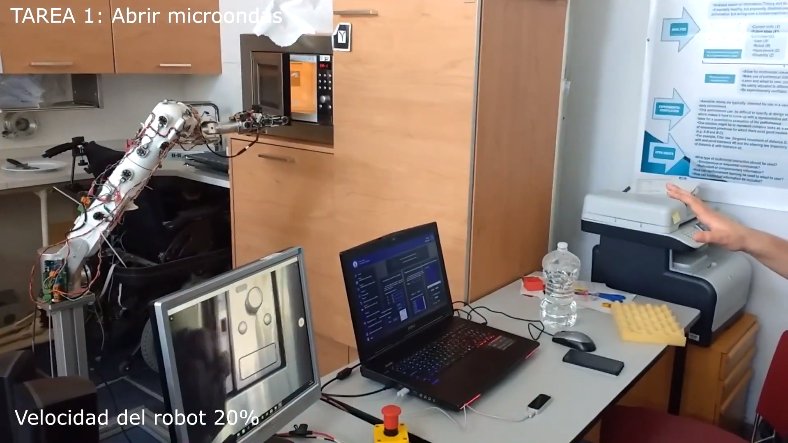
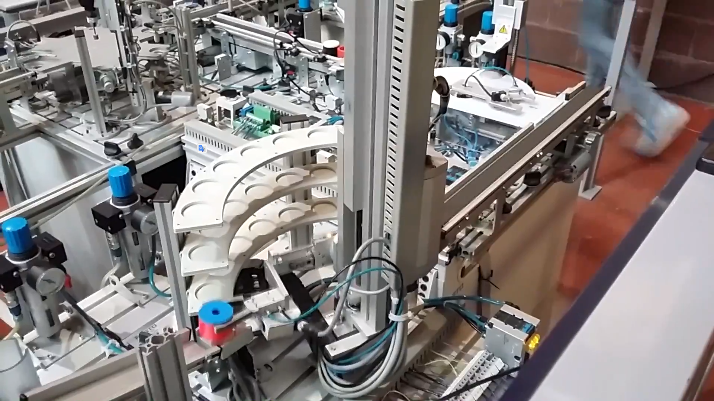
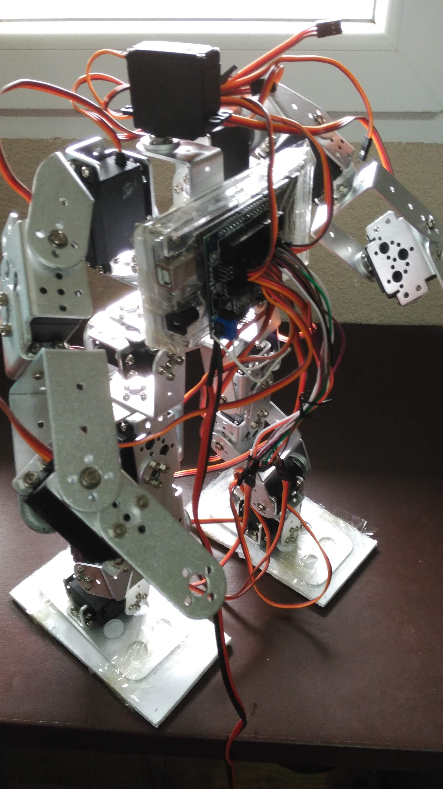
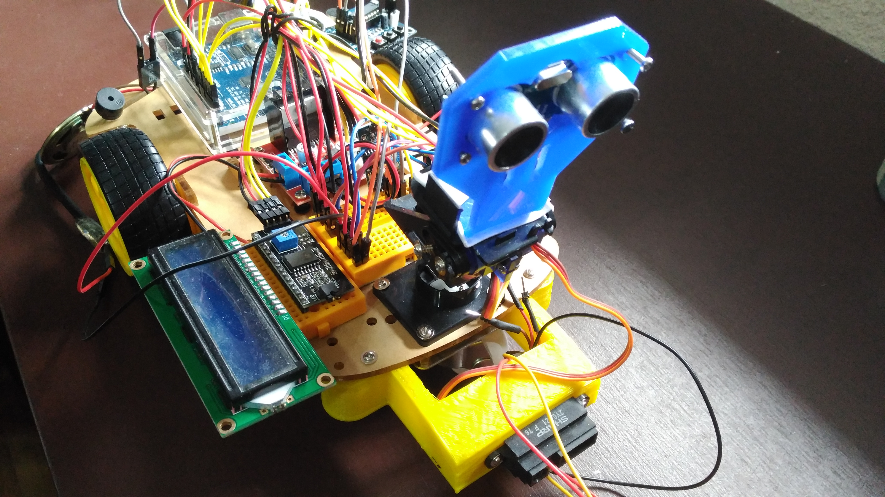

# About me

Grado en Ingeniería en Tecnologías Industriales.Sello de Intensificación en Automática y Electrónica, S.E.T. 
Sello de Emprendedor, S.E.T.Finalista Premios Consejo Social TFG Emprende. Semifinalista Premios VENTURES4GRANCANARIA. 
Publicación Congreso Internacional Tecnología y Turismo para todas las personas, Accesibilidad 4.0, DRT4ALL 2017.

- [Projects](#projects)
	- [Módulo de reconocimiento gestual para control de robot en tareas de asistencia](#Módulo-de-reconocimiento-gestual-para-control-de-robot-en-tareas-de-asistencia) 
	- [Robot de almacenaje en célula flexible de fabricación](#Robot-de-almacenaje-en-célula-flexible-de-fabricación)
	- [Robótica Industrial](#Robótica-Industrial)
	- [Leap motion Drone controller](#Leap-motion-Drone-controller)
	- [RL78-G14 Space Invaders](#RL78-G14-Space-Invaders)
	- [Tensorflow Object Recognition](#Tensorflow-Object-Recognition)
	- [Bewi Robot humanoide](#Bewi-Robot-humanoide)
	- [Wish Robot movil](#Wish-Robot-movil)
	- [Promethus Drone](#Promethus-Drone)
	- [Barret: Plotter CNC](#Barret-Plotter-CNC)
	- [Medical Scale IMC](#Medical-Scale-IMC)
	- [O.C.R](#O.C.R)
	- [S.I.D.R.O](#S.I.D.R.O)
- [Contact me](#contact-me)

## Projects

### Módulo de reconocimiento gestual para control de robot en tareas de asistencia 

Figura 1. Entorno habilitado

Módulo para el control de robots y herramientas electro-mecánicas vía gestos y voz.
Control operativo en tareas asistenciales, mediante el uso del módulo. Control 6 g.d.l, control telemático e inalámbrico, con incorporación simultanea de control por voz.
Movimiento cartesiano X, Y, Z, así como movimiento rotacional Yaw, Pitch, Roll, junto al control de estado de la pinza en cuestión.

Asistencia mediante notificaciones de control e instrucciones de uso.
Modalidades de funcionamiento:

- Control tiempo real cartesiano.

- Control tiempo real velocidades de inclinación.

- Control tiempo real campo de velocidades de inclinación.

- Control por voz.

- Simultanea de control por voz, con un método gestual.

Para más información consulte: [Sitio web](http://davidvelascogarcia.blogspot.com.es/2017/09/modulo-de-reconocimiento-gestual-para.html)

#### Robot de almacenaje en célula flexible de fabricación

Figura 2. Robot de almacenaje

Programación en lenguaje de contactos de robot de almacenaje en célula de fabricación flexible.

Para más información consulte: [Sitio web](http://davidvelascogarcia.blogspot.com.es/2017/10/robot-de-almacenaje-en-celula-de.html)

### Robótica Industrial

Figura 3. Simulación

Simulación mediante Robotstudio de una célula flexible, de transporte y limpieza de androides, visualización en forma secuencial, de un solo ciclo.

Para más información consulte: [Sitio web](http://davidvelascogarcia.blogspot.com.es/p/robotica-industrial.html)

### Leap motion Drone controller
        
Controlador de drone quadcopter, con placa de control arduino.      
        
### RL78-G14 Space Invaders
        
Clásico juego de arcade Space Invaders, programado en C, para la placa de desarrollo RL78/G14 de Renesas.

Figura 4. RL78/G14    

### Tensorflow Object Recognition
        
Reconocimiento de objetos mediante el uso de la API Tensorflow Object Recognition.
Detección de objetos del entorno de trabajo tanto por imagen como por cámara en tiempo real.

Figura 5. API Tensorflow Object Recognition

### Bewi Robot humanoide
        
Bewi es un robot humanoide de 20 gdl autónomo de apoyo multifuncional. Se trata de un robot autónomo, capaz de analizar el entorno gracias a un sensorizado. Haciéndolo ideal para la detección de dióxido de carbono, alcohol, amoniaco, butano, propano y metano. A su vez, es capaz de detectar la temperatura, permitíendole la detección de fuegos.
Tiene la capacidad de detección de humedades. Incluye reconocimiento de voz, así como interacción con el usuario a través de la misma. Junto a un sistema de detección y reconocimiento de objetos vía webcam para control a distancia.
Incluye modo de control manual vía control por voz, medios gestuales y teclado o gamepad.

Figura 1. Prototipo Bewi        
        
#### Wish Robot movil
        
Wish es un robot móvil autónomo de apoyo multifuncional. Se trata de un robot autónomo, capaz de analizar el entorno gracias a un sensorizado. Haciéndolo ideal para la detección de dióxido de carbono, alcohol, amoniaco, butano, propano y metano. A su vez, es capaz de detectar la temperatura, permitíendole la detección de fuegos. Tiene la capacidad de detección de humedades. Incluye reconocimiento de voz, así como interacción con el usuario a través de la misma. Junto a un sistema de detección y reconocimiento de objetos vía webcam para control a distancia. Incluye modo de control manual vía control por voz, medios gestuales y teclado o gamepad.       

        
### Promethus Drone
        
Drone inteligente.        
        
### Barret Plotter CNC
        
Plotter CNC inteligente.

### Medical Scale IMC
        
Báscula médica para el cálculo de IMC, con placa de control arduino, LCD y sensor infrarrojo SHARP para media de alturas.

Para más información consulte: [Documentación](https://es.slideshare.net/DavidVelascoGarcia/bscula-mdica-de-clculo-del-imc)
        
#### O.C.R
        
**Optical Character Recognition**

*O.C.R es un software libre de código abierto.*
Se trata de un proyecto de extracción de texto a partir de imágenes, empleando la tecnología OCR.
Actualmente en fase betha v 1.0, con funcionalidades de extracción de imágenes en ficheros de formato .png, .jpg, .bmp, tiff, .gif.
Incluye  notificaciones sonoras, mensajes de bienvenida y despedida al usuario.

Desarrollado en C# y .NET, con uso de librerias Speech de Microsoft, así como DLL de desarrollo de Tesseract.

Figura 1. Logo O.C.R

Para más información consulte: 

- [Video](https://www.youtube.com/watch?v=UbUXkQyqtrw&t=1s)

- [WebSite](https://davidvelascogarcia.blogspot.com.es/)

- [Descarga](https://github.com/davidvelascogarcia)

### S.I.D.R.O
        
**Sistema de identificación, detección y reconocimiento de objetos**

*S.I.D.R.O es un software libre de código abierto.*
Se trata de un proyecto de detección, identificación y reconocimiento de objetos, por medio de Machine Learning.
Actualmente en fase betha v 1.0, con funcionalidades de detección de movimiento y captura de los frames modificados. Incluye nivel de detección ante la variación de las capturas, así como notificaciones sonoras de alarma y mensajes de bienvenida y despedida al usuario.
Desarrollado en C# y .NET, con uso de librerias Speech de Microsoft, así como DLL de desarrollo de imagen Aforge 2.2.5.

Figura 1. Logo S.I.D.R.O

Para más información consulte: 

- [Video](https://www.youtube.com/watch?v=6xuxJO7wIko)

- [WebSite](https://davidvelascogarcia.blogspot.com.es/)

- [Descarga](https://github.com/davidvelascogarcia)

## Contact me

- [ORCID](http://orcid.org/0000-0001-7934-2836)         
- [ResearchGate](https://www.researchgate.net/profile/David_Velasco_Garcia)        
- [Mendeley](https://www.mendeley.com/profiles/david-velasco-garcia/)      
- [GitHub](https://github.com/davidvelascogarcia)            
- [SlideShare](https://es.slideshare.net/DavidVelascoGarcia)        
- [Linkedin](https://www.linkedin.com/in/davidvelascogarcia/)     
- [Youtube](https://www.youtube.com/channel/UCsC2ihUdekiNy3KlXhBcH4Q?view_as=subscriberpolymer%3Dtrue)      
- [Google+](https://plus.google.com/u/0/+DavidVelascoGarcia)   
- [Thingiverse](https://www.thingiverse.com/davidvelascogarcia/about)         
- [Blogspot](http://davidvelascogarcia.blogspot.com.es/) 
